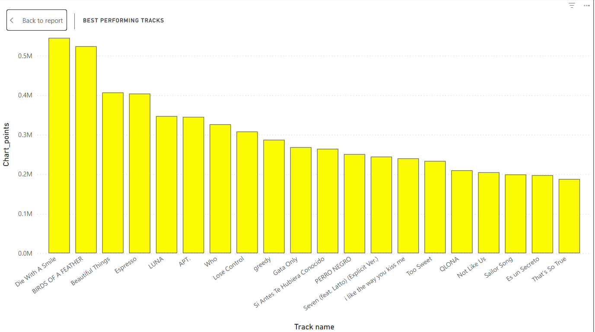
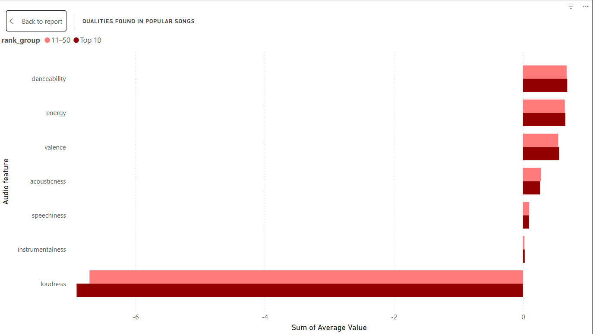
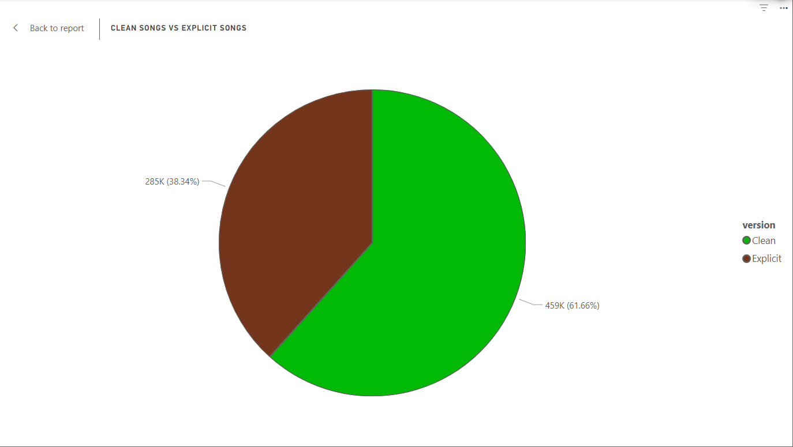
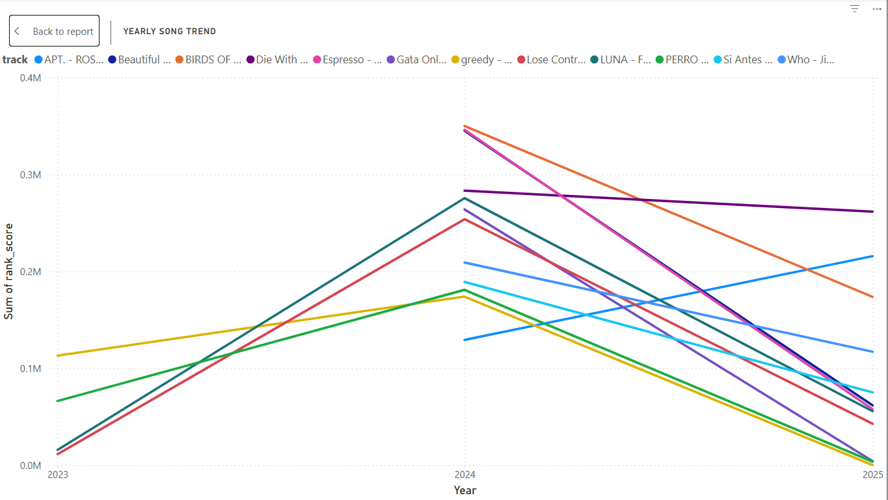

# Spotify Daily Top 50 Analysis (2023–2025) 🎧📊


Interactive Power BI dashboard and SQL analysis exploring what drives success in Spotify's daily Top 50 charts (global + country-level snapshots).

## 📌 Project Overview

This project investigates patterns in Spotify's daily Top 50 songs using chart positions, audio features (danceability, energy, valence, etc.), popularity scores, explicit flags, and release info.

**Main Questions Answered:**

- What really makes a song dominate the charts? (weighted scoring vs. raw appearances)
- Do Top 10 tracks have different audio characteristics compared to #11–50?
- Has explicit content become a major advantage in recent years?
- How do performance trends evolve year-over-year?

**Key Takeaways (Spoiler Alert):**

- Explicit songs heavily dominate Top 10 positions (~85–95%)
- Top 10 tracks consistently show higher danceability, energy, and valence
- Loudness is uniformly high — modern hits are mastered aggressively

## 🗂️ Dataset

**Source:** Kaggle Spotify daily Top 50 chart snapshots

**Key Columns Used:**

- `spotify_id`, `name`, `artists`
- `daily_rank`, `popularity`, `is_explicit`
- `danceability`, `energy`, `key`, `loudness`, `mode`, `speechiness`, `acousticness`, `instrumentalness`, `liveness`, `valence`, `tempo`
- `snapshot_date`, `album_release_date`

**Time Coverage:** Primarily 2023–2025 snapshots  
**Granularity:** Daily ranks per country + global

## 🛠️ Methodology

1. **Data Preparation**
   - Cleaned and loaded CSV data
   - Handled explicit/clean version duplicates (kept dominant version by #1 days or appearances)

2. **Feature Engineering (SQL)**
   - Weighted chart success score: `chart_points = 51 - daily_rank` → sum per track
   - Popularity decay rate: `(peak_popularity - final_popularity) / (days_on_chart / 7.0)`
   - Rank buckets: Top 10 vs 11–50
   - Aggregations: average features by rank group, explicit vs clean breakdown

3. **Visualization & Dashboard**
   - Built in Power BI
   - Interactive filters (track selection, year, rank group)
   - Visuals: bar charts, diverging bars, pie charts, line trends

## 📈 Key Findings & Visuals

### Best Performing Tracks (Weighted Chart Points)

Top tracks ranked by total chart_points (rewards #1 positions more than lower ranks).

  
_(Tracks like "Die With A Smile", "BIRDS OF A FEATHER", "Espresso", "APT." lead — strong 2024/2025 performers)_

### Audio Features: Top 10 vs 11–50

Clear gradient: higher danceability, energy, and valence in Top 10. Loudness shows almost no difference.



### Explicit vs Clean Distribution

Explicit tracks make up ~62% of strong performers / long-charting songs.



### Yearly Song Trend

Sum of rank_score over time for top tracks — shows peak performance and decay patterns.



## 🧰 Tech Stack

- **Data Processing & Analysis** → SQL (PostgreSQL / BigQuery style queries)
- **Visualization & Dashboard** → Power BI (DAX for measures, interactive slicers)
- **Exploration / Cleaning** → Jupyter Notebook (`pyclean.ipynb`)
- **Version Control** → Git / GitHub

## 🚀 How to Run / Reproduce

1. Clone the repo:
   ```bash
   git clone https://github.com/dozie-oc/Spotify_songs.git
   ```
2. Get similar data:
   Download a Spotify daily charts dataset (e.g., Kaggle: "Spotify Top 50" or "daily charts snapshots")

3. Explore / clean:
   Open pyclean.ipynb for initial cleaning steps

4. Run SQL analysis:
   Use files in song_analysis_sql/ folder
   Execute in your preferred SQL tool (BigQuery, pgAdmin, DBeaver, etc.)

5. Build dashboard:
   Import cleaned data into Power BI
   Recreate visuals using the screenshots as reference
   Add slicers for interactivity

⭐ If you find this project useful, give it a star!
Questions or feedback? Open an issue or reach out.
